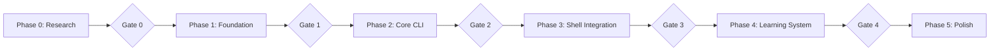

# Slipstream Development Phases

## Overview

---

## Phase 0: Research & Validation
**Duration:** 1-2 days  
**Goal:** Resolve all open questions before implementation

### Tasks
| Task | Priority | Deps | Status |
|------|----------|------|--------|
| R1: Test CLI latency | P0 | - | ⏳ |
| R2: Test session.idle behavior | P0 | - | ⏳ |
| R3: Test commands with shell | P0 | - | ⏳ |
| R4: Test skill auto-discovery | P0 | R2 | ⏳ |
| R5: Check gum/fzf availability | P0 | - | ⏳ |

### Deliverables
- [ ] Complete research.md with results
- [ ] Decision: CLI vs SDK
- [ ] Decision: Learning trigger mechanism
- [ ] Decision: Command vs tool for /fix

### Gate 0: Research Complete
- [ ] All R1-R5 completed with documented results
- [ ] Implementation approach finalized
- [ ] No blocking uncertainties remain

---

## Phase 1: Foundation
**Duration:** 2-3 days  
**Goal:** Set up project structure and OpenCode plugin

### Tasks
| Task | Priority | Deps | Status |
|------|----------|------|--------|
| Create plugin from template | P0 | Gate 0 | ⏳ |
| Set up config directory structure | P0 | - | ⏳ |
| Create slipstream.jsonc | P0 | - | ⏳ |
| Write primary agent prompt | P1 | - | ⏳ |
| Write learner sub-agent prompt | P1 | - | ⏳ |
| Write crawl sub-agent prompt | P2 | - | ⏳ |

### Deliverables
- [ ] `~/.config/opencode/slipstream/` structure created
- [ ] Plugin scaffolded and installable
- [ ] Agent prompts written
- [ ] Can run `opencode --agent slipstream`

### Gate 1: Foundation Complete
- [ ] `opencode --agent slipstream "hello"` works
- [ ] Custom context tool callable
- [ ] Plugin loads without errors

---

## Phase 2: Core CLI (slip)
**Duration:** 3-4 days  
**Goal:** Working `slip` command with server management

### Tasks
| Task | Priority | Deps | Status |
|------|----------|------|--------|
| Implement slip main command | P0 | Gate 1 | ⏳ |
| Implement server start/stop/status | P0 | - | ⏳ |
| Implement health check loop | P0 | - | ⏳ |
| Implement port conflict handling | P1 | - | ⏳ |
| Implement TTY-based session ID | P0 | - | ⏳ |
| Implement slip session list | P1 | - | ⏳ |
| Implement slip session attach | P1 | - | ⏳ |
| Implement slip model list/set | P2 | - | ⏳ |

### Deliverables
- [ ] `slip "prompt"` works
- [ ] `slip server start/stop/status`
- [ ] `slip session list/attach`
- [ ] `slip model list`
- [ ] Health checking with graceful restart

### Gate 2: CLI Functional
- [ ] slip starts server if needed
- [ ] slip reuses existing session for same TTY
- [ ] slip session list shows sessions with titles
- [ ] slip server status shows health info

---

## Phase 3: Shell Integration
**Duration:** 3-4 days  
**Goal:** oh-my-zsh plugin and prompt mode toggle

### Tasks
| Task | Priority | Deps | Status |
|------|----------|------|--------|
| Create slipstream.plugin.zsh | P0 | Gate 2 | ⏳ |
| Implement # prefix trigger | P0 | - | ⏳ |
| Implement Ctrl+A toggle mode | P1 | - | ⏳ |
| Implement 🤖 prompt indicator | P1 | - | ⏳ |
| Implement model indicator | P2 | - | ⏳ |
| Implement command_not_found hook | P2 | - | ⏳ |

### Deliverables
- [ ] oh-my-zsh plugin installable
- [ ] `# how do I` triggers slip
- [ ] Ctrl+A Ctrl+A toggles prompt mode
- [ ] Mode and model indicators in prompt

### Gate 3: Shell Integration Complete
- [ ] User can activate via oh-my-zsh plugins=(... slipstream)
- [ ] All mode toggles work
- [ ] Prompt indicators update correctly

---

## Phase 4: Learning System
**Duration:** 2-3 days  
**Goal:** Skills-based adaptive learning

### Tasks
| Task | Priority | Deps | Status |
|------|----------|------|--------|
| Implement session.idle hook | P0 | Gate 3 | ⏳ |
| Implement learner sub-agent trigger | P0 | - | ⏳ |
| Create slipstream-prefs skill template | P0 | - | ⏳ |
| Create slipstream-aliases skill template | P1 | - | ⏳ |
| Create slipstream-workflows skill template | P2 | - | ⏳ |
| Implement slip skill list | P1 | - | ⏳ |
| Implement slip skill create | P2 | - | ⏳ |

### Deliverables
- [ ] Learning triggers on session completion
- [ ] Skills created in `~/.opencode/skill/`
- [ ] Agent loads skills via `skill()` tool
- [ ] slip skill list shows skills

### Gate 4: Learning Works
- [ ] After 3+ sessions, preferences skill has content
- [ ] Agent behavior adapts based on skills
- [ ] slip skill list shows slipstream-* skills

---

## Phase 5: Polish & Commands
**Duration:** 2-3 days  
**Goal:** Refined UX and custom commands

### Tasks
| Task | Priority | Deps | Status |
|------|----------|------|--------|
| Create /fix command | P0 | Gate 3 | ⏳ |
| Create /explain command | P1 | - | ⏳ |
| Create /review command | P2 | - | ⏳ |
| Implement gum-based UI tools | P1 | R5 | ⏳ |
| Create slip plugin install | P2 | - | ⏳ |
| Write README with examples | P0 | - | ⏳ |
| Create installation script | P1 | - | ⏳ |

### Deliverables
- [ ] `/fix` analyzes and suggests corrections
- [ ] `/explain tar -xzvf` documents command
- [ ] gum-based choose/confirm tools work
- [ ] README complete with demos
- [ ] One-line install script

### Gate 5: Release Ready
- [ ] All tests passing
- [ ] README comprehensive
- [ ] Install script tested on fresh system
- [ ] Demo video/GIF created

---

## Summary

| Phase | Duration | Key Deliverable |
|-------|----------|-----------------|
| 0: Research | 1-2 days | Resolved decisions |
| 1: Foundation | 2-3 days | Plugin + agents |
| 2: Core CLI | 3-4 days | slip command |
| 3: Shell Integration | 3-4 days | oh-my-zsh plugin |
| 4: Learning | 2-3 days | Adaptive skills |
| 5: Polish | 2-3 days | Commands + docs |
| **Total** | **13-19 days** | Production ready |
